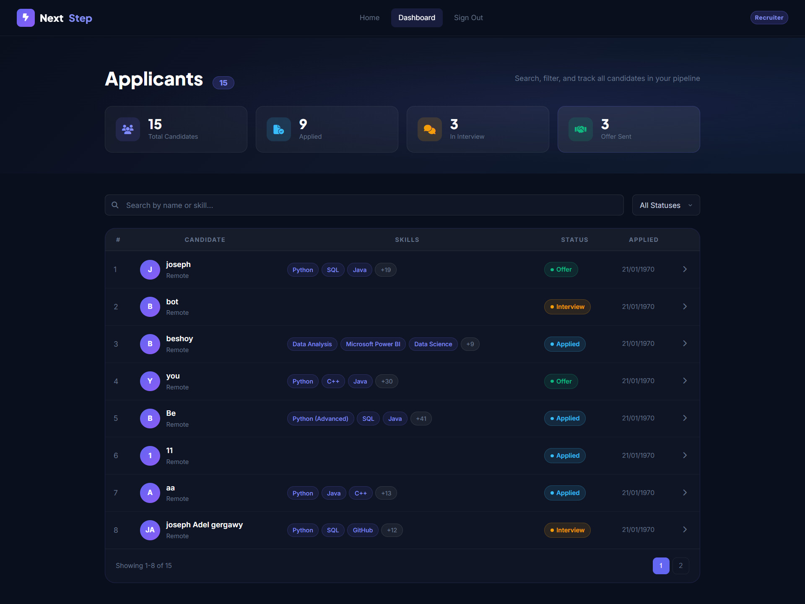
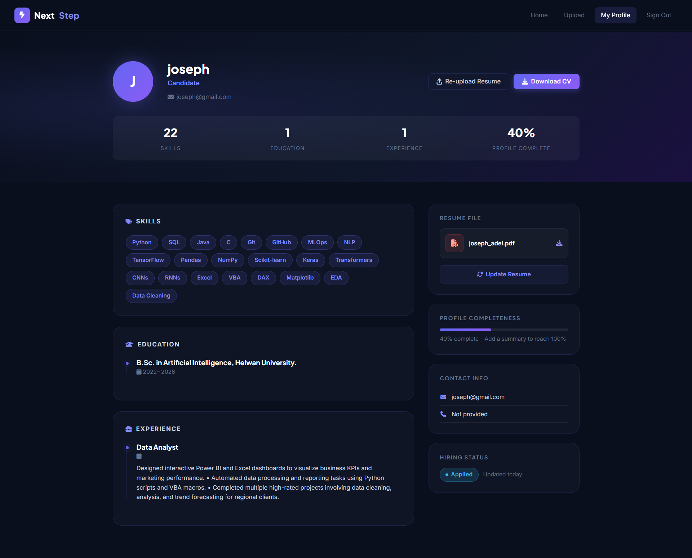
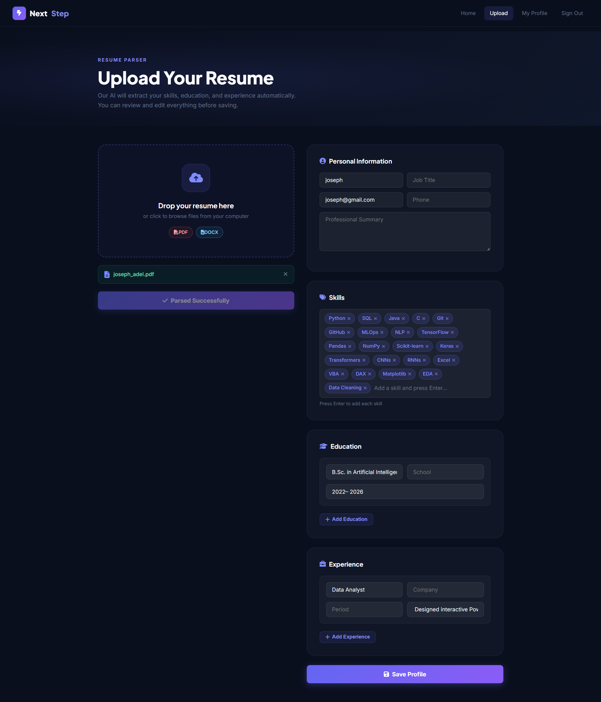

# NextStep - AI Resume & Candidate Intelligence Platform

🚀 **Live Demo:** [http://13.53.39.78:8080/](http://13.53.39.78:8080/)

NextStep (also known as HireFlow) is an AI-powered recruitment platform designed to streamline the hiring process. It automatically extracts, structures, and organizes information from candidate resumes to significantly reduce the manual effort of resume screening, making candidate comparison faster and more efficient.

## 🌟 Key Features

* **Resume Upload & Parsing:** Candidates can upload their resumes (PDF/DOCX), and the system automatically extracts key details such as name, skills, education, and experience using AI.
* **Profile Generation:** Extracted data is stored systematically to create clear, organized candidate profiles.
* **Recruiter Dashboard & Search:** A centralized interface allowing recruiters to browse, apply skill-based filters, and search for candidates using specific keywords.
* **Pipeline Tracking:** Allows recruiters to move candidates through different hiring stages (e.g., "Reviewed", "Interview").

---

## 📸 Screenshots

*(Place your screenshots in the `screenshots` folder and link them here)*

* **Dashboard View**
  

* **Candidate Profile**
  

* **Resume Upload**
  

---

## 🛠️ Tech Stack

* **Frontend:** HTML, CSS (Bootstrap), JavaScript
* **Backend:** Python, FastAPI, JWT (Authentication)
* **AI & NLP:** Transformers (BERT / LoRA for Natural Language Understanding)
* **Database:** MySQL
* **Cloud Services (AWS):** Amazon EC2, Amazon S3, AWS Security Groups
* **Deployment & Ops:** Docker, Docker Compose, Terraform

---

## 📁 Repository Structure

```
.
├── ai_service/        # FastAPI service containing the AI NLP models for parsing
├── backend/           # Core FastAPI backend for handling users, auth, and database
├── css/               # Custom frontend styling
├── infrastructure/    # Terraform scripts for AWS deployment
├── user/              # Frontend HTML templates
├── screenshots/       # UI Screenshots for documentation
├── .gitignore         # Git ignore rules
├── index.html         # Main entry point for the frontend
├── commands.md        # Detailed list of useful commands
└── README.md          # Project documentation (You are here)
```

---

## 🚀 Setup and Configuration

This project can be run locally via Python virtual environments or seamlessly using Docker. 

### Prerequisites
* Python 3.9+
* Docker & Docker Compose (Optional but recommended)
* MySQL Database

### Method 1: Using Docker (Recommended)

1. **Build and Run all services** (assuming you have a `docker-compose.yml` set up):
   ```bash
   docker-compose up --build -d
   ```
   *This will spin up both the backend and AI services.*

2. **Access the application:**
   * Frontend: Open `index.html` in your browser or run a simple server (`python -m http.server 8080`)
   * Backend API: `http://localhost:8000`
   * AI Service API: `http://localhost:8001`

### Method 2: Local Setup (Without Docker)

#### 1. Backend Setup
```powershell
cd backend
python -m venv venv
.\venv\Scripts\activate
pip install -r requirements.txt
uvicorn main:app --reload
```

#### 2. AI Service Setup
```powershell
cd ai_service
python -m venv venv
.\venv\Scripts\activate
pip install -r requirements.txt
uvicorn main:app --reload --port 8001
```

#### 3. Frontend Setup
```powershell
# From the root directory
python -m http.server 8080
# Open http://localhost:8080 in your browser
```

---

## ☁️ Cloud Deployment (AWS)

This project includes Infrastructure-as-Code (IaC) using Terraform to deploy on AWS.

```powershell
cd infrastructure
terraform init
terraform plan
terraform apply
```

## 📄 License
This project was built as an Integrated Academic Project.
